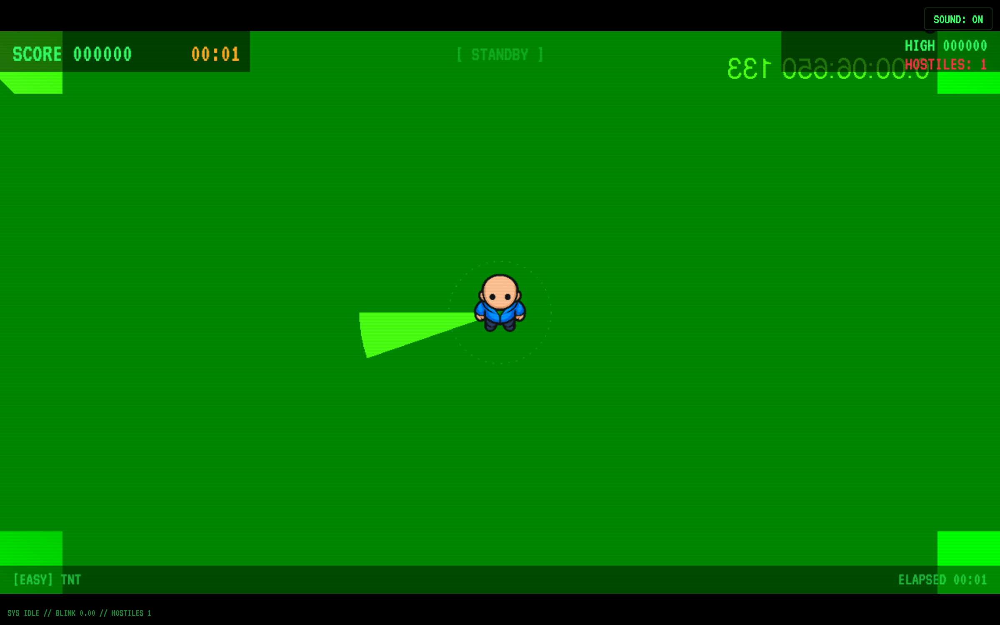
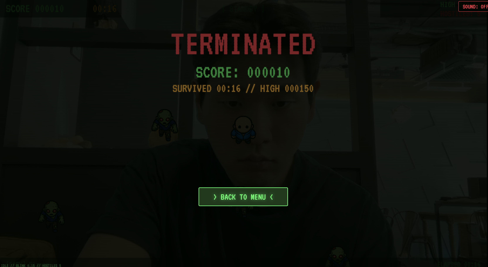
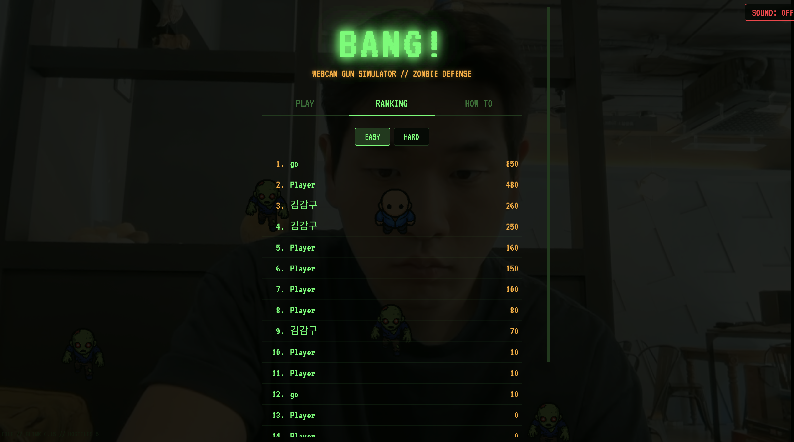

# bang-zombie

> 손이 총이 되고, 윙크가 방아쇠가 되는 웹캠 좀비 슈터.  
> A vibe-coded webcam arcade experiment by [TNT Games](https://tntgames.xyz).

`bang-zombie`는 웹캠으로 손과 얼굴을 인식해서  
**권총 포즈로 조준하고, 윙크로 발사하는 브라우저 게임**입니다.

설치 없이 바로 켜서, 카메라만 허용하면 곧바로 플레이할 수 있게 만드는 게 이 프로젝트의 핵심입니다.  
말 그대로 “왜 이런 걸 만들었지?” 싶은 아이디어를 끝까지 밀어붙인 바이브 코딩 프로젝트입니다.

---

## Play

- **Live**: https://tntgames.xyz
- **Studio**: TNT Games
- **Repository**: https://github.com/Gojaehyeon/bang-zombie

> 브라우저에서 카메라 권한 허용이 필요합니다.

---

## Screenshots

### Gameplay



### Game over



### Ranking



> README 이미지는 Puppeteer로 캡처했습니다.  
> `npm run screenshots:readme`

---

## What it is

이 게임은 FPS라기보다는  
**웹캠 제스처 인식 + 레트로 아케이드 슈터 + 약간의 장난기**에 가깝습니다.

손을 카메라 앞에 들면:

1. **검지 끝**이 조준점이 되고
2. **권총 포즈**를 잡으면 무장이 되며
3. **윙크**하면 발사되고
4. 좀비를 처치해서 점수를 올리면
5. **500점부터 쌍권총 모드**가 열립니다

---

## Features

- **웹캠 기반 손 인식**
  - MediaPipe HandLandmarker 사용
  - 양손 인식 지원
  - 3D 거리 기반 권총 포즈 판정

- **얼굴 인식 기반 발사**
  - MediaPipe FaceLandmarker 사용
  - 윙크/눈 감기 점수 기반 발사 트리거

- **듀얼 건 시스템**
  - 500점 이상 달성 시 자동 해금
  - 양손 독립 커서
  - 동시 발사
  - 전용 BGM 전환

- **좀비 3종**
  - 일반 / 러너 / 탱커
  - 속도, 체력, 크기, 점수 차등

- **끝없이 올라가는 난이도**
  - 웨이브 대신 시간 기반 무한 스폰
  - Easy / Hard 난이도 지원

- **레트로 CRT 스타일 UI**
  - VT323 폰트
  - 스캔라인
  - 초록 인광 HUD

- **리더보드**
  - Supabase 기반
  - 난이도별 상위 100명 저장

- **사운드**
  - 메뉴 / 게임 / 듀얼 건 / 게임오버 BGM
  - 발사 / 처치 / 클릭 SFX

---

## Controls

### Desktop

- **조준**: 카메라 앞에서 손으로 권총 포즈
- **발사**: 윙크
- **일시정지**: `ESC`

### Mobile

- 세로 모드 플레이 대응
- 브라우저 / 기기 환경에 따라 카메라 권한 허용 필요

---

## Tech stack

- **Vite**
- **TypeScript**
- **HTML5 Canvas**
- **MediaPipe Tasks Vision**
  - HandLandmarker
  - FaceLandmarker
- **Supabase**
- **Electron** (desktop wrapper for local dev/build)
- **Vercel**

---

## Run locally

```bash
npm install
npm run dev
```

브라우저에서 `http://localhost:5173`를 열고:

1. 카메라 권한 허용
2. 닉네임 입력
3. 난이도 선택
4. 게임 시작

### Electron dev

```bash
npm run electron:dev
```

### Production build

```bash
npm run build
```

---

## Notes

- 이 게임은 **카메라 권한이 없으면 동작하지 않습니다**
- 일부 인앱 브라우저에서는 카메라 접근이 제한될 수 있습니다
- 가장 안정적인 환경은 최신 Chrome / Safari / Edge 계열 브라우저입니다

---

## Project structure

```text
src/
├── main.ts
├── audio/
├── db/
├── face/
├── game/
└── hand/

electron/
└── main.cjs

docs/
├── 기획서.md
├── 인수인계서.md
└── 프롬프트.md
```

---

## Docs

- [기획서](docs/기획서.md)
- [인수인계서](docs/인수인계서.md)
- [프롬프트](docs/프롬프트.md)

---

## Why I made this

그냥 재밌어 보여서 만들었습니다.

정확히는:

- 웹캠으로 손을 총처럼 인식시키고
- 윙크를 발사 입력으로 쓰고
- 그걸 레트로 좀비 게임으로 묶으면
- 생각보다 훨씬 이상하고 재밌는 결과가 나옵니다

이 프로젝트는  
**쓸모보다 재미, 완성도보다 추진력, 설명 가능성보다 “일단 해보자”** 쪽에 더 가까운 작업입니다.

그래서 더 좋습니다.

---

## License

MIT
